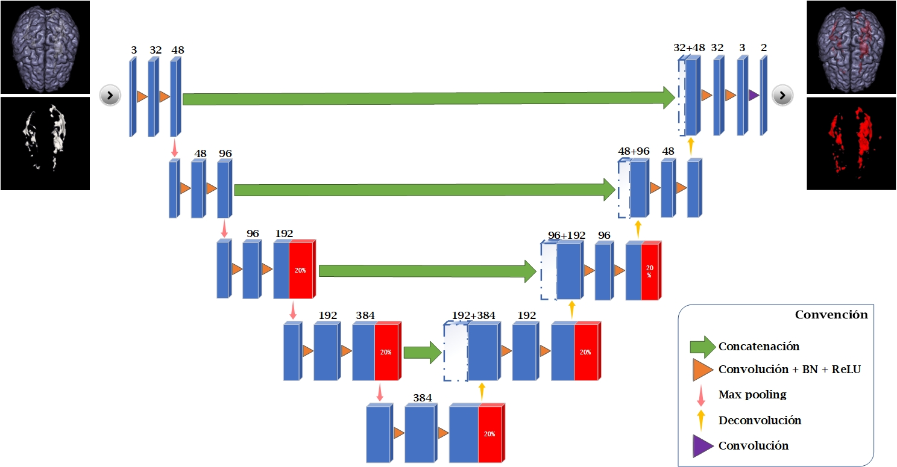
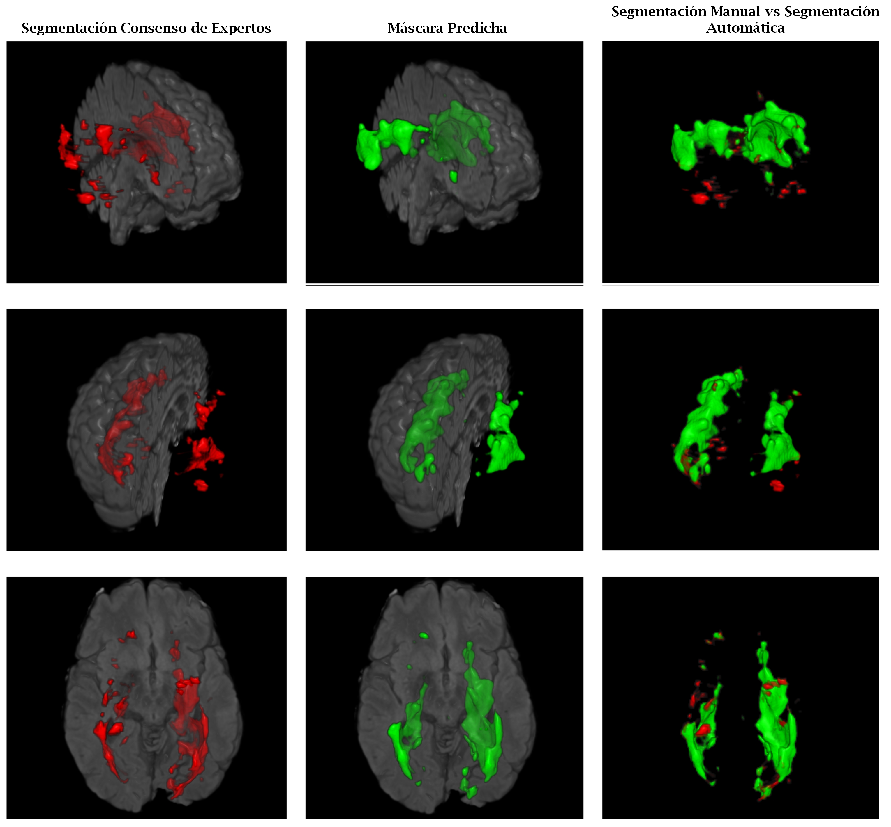
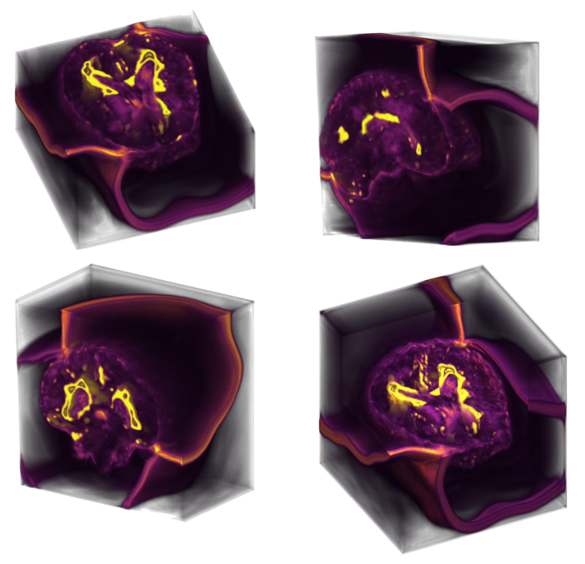
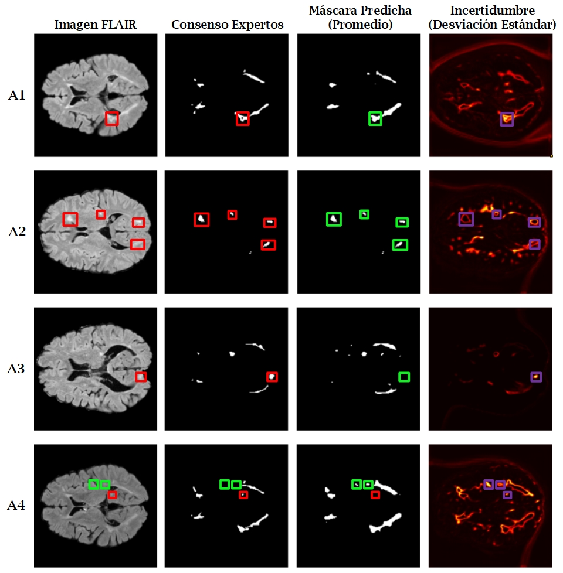
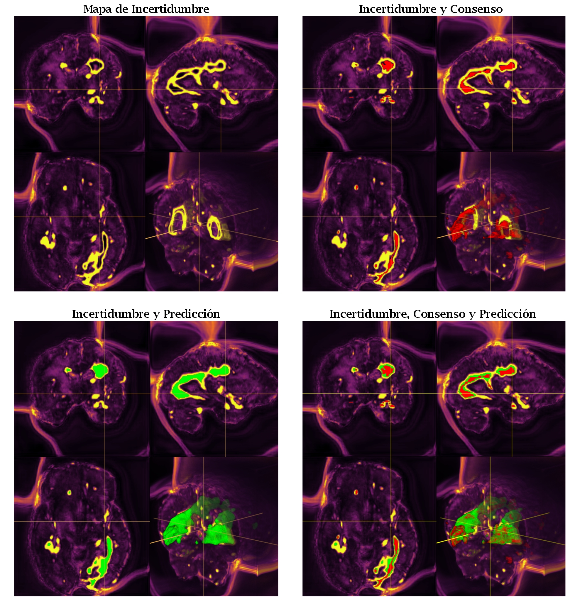

# UNet3D-MonteCarloDropout
Segmentación semántica de lesiones de esclerosis múltiple con U-Net 3D (determinista y con aproximación bayesiana)

En este trabajo, se presenta una metodología para la segmentación de lesiones de esclerosis múltiple (EM) en imágenes de resonancia magnética (IRM) que aborda las limitaciones de los modelos deterministas mediante la incorporación de la estimación de incertidumbre. Se compara una arquitectura U-Net 3D determinista con una versión modificada que emplea una aproximación bayesiana con Monte Carlo Dropout (MCD) para cuantificar la incertidumbre epistémica. Los resultados demuestran que, si bien ambos modelos alcanzan un rendimiento competitivo en términos de las métricas estándar de segmentación de imágenes médicas, la estimación de incertidumbre proporciona información valiosa sobre la fiabilidad de las predicciones, especialmente en regiones desafiantes como los bordes de las lesiones. Esto tiene el potencial de mejorar la aplicabilidad clínica de la segmentación automática al permitir a los usuarios médicos evaluar la confianza en los resultados y enfocar su revisión en áreas de mayor incertidumbre

